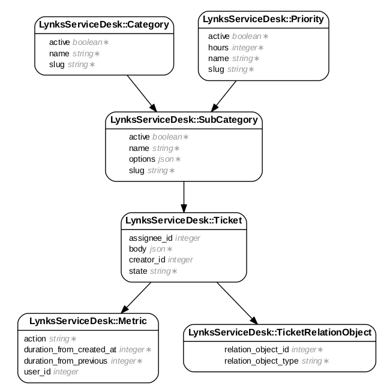

# LynksServiceDesk
Fully Configurable Ticketing API Engine, with categories, sub categories, states, priorities, metrics, relation objects, custom objects, and more!

## Configuration
### Initialization
Add this line to your application's Gemfile:

```ruby
gem 'lynks_service_desk'
```

Run the following
```ruby
rake lynks_service_desk:install:migrations
rake db:migrate
```
Create the configuration file
```ruby
rails generate lynks_service_desk:config
```

This creates a configuration file, and can be found as `config/initializers/lynks_service_desk_config.rb`


## Configuration
Inside `config/initializers/lynks_service_desk_config.rb`, you will find the following options available:

```ruby 
config.ticketable_classes
# This expects an array of classes. 
Example = ["Order", "User", "Item"]
Default = []
```

```ruby
config.priorities
# This expects a hash, where the key is the priority's name,
# and the value is the number of hours allocated
Example = {
	"Priority Name": no_of_hours
}
Default = {
	"high" => 12,
	"medium" => 24,
	"low" => 48
}
```

```ruby
config.tickets_types
# This expects a hash in the following format
{
	"Category Name" => {
		"Sub Category Name" => "Priority Name"
	}
}
Default = {}
```

```ruby
config.sub_categories_parameters
# This expects a hash in the following format
{
	"Sub Category Name" => {
		"parameter_name" => Datatype
	}
}
# Available data types: String, DateTime, Date, Integer, Float
Default = {}
```

```ruby
config.sub_categories_messages
# This expects a hash in the following format
{
	"Sub Category Name" => {
		locale: "Hello %name"
	}
}
# words preceded with a '%' sign will be subbed with its value in config.sub_categories_parameters
Default = {}
```

```ruby
config.record_state_transitions_as_metrics
# This expects a boolean
# Toggles whether metrics are created upon state transition or not
Default = true
```

```ruby
config.allowed_metric_types
# This expects an array of allowed metrics
Example = ["First view", "First customer contact"]
Default = []
```

```ruby
config.initial_state
# This expects a string
Example = "Awaiting reply"
Default = "Open"
```

```ruby
config.check_for_unopened_using_metrics
# This expects a boolean
# Setting this to true, will default all tickets with no metrics yet to the state "unopened".
# There is no need to set this as true if your initial state is already "unopened"
Default = true
```
```ruby
# config.state_transitions
# This expects a state transitions hash in the following format
Example = {
	"transition_action_name_1" => ["from_state_name", "to_state_name_1"],
	"transition_action_name_2" => [["from_state_name_1", "from_state_name_2"],"to_state_name_2"]
}
Default = {
	"Mark as on hold" => ["Open", "On Hold"],
	"Close" => [["Open", "On Hold"], "Closed"]
}
```

## Paths

### Create New Ticket
`POST - /tickets.json `

```json
{
	"creator_id": 1,
	"assignee_id": 2,
	*"sub_category": {
		**"name": "Price Change",
		**"slug": "price-change",
		*"options": {
			*"price_before": 10,
			*"price_after": 10.5,
			*"due_date": "1-1-2017",
			*"name": "hello"
		}
	},
	"references": {
		"order_id": 1,
		"item_ids": [1,2,3]
	}
}
```

## Installation

And then execute:
```bash
$ bundle install
```

## Database


## Contributing
Contribution directions go here.
