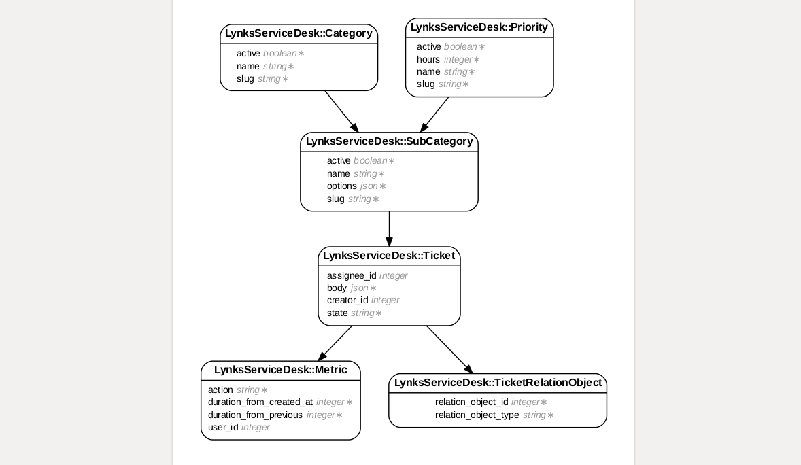

# LynksServiceDesk


## Usage
```
createdb lynks_service_desk_development
rake app:db:migrate
rake app:populate
```

## Configuration
### Initialization
Add this line to your application's Gemfile:

```ruby
gem 'lynks_service_desk'
```

Run the following
```ruby
rake lynks_service_desk:install:migrations
rake db:migrate
```
Create the configuration file
```ruby
rails generate lynks_service_desk:config
```

This creates a configuration file, and can be found as `config/initializers/lynks_service_desk_config.rb`


## Configuration
Inside `config/initializers/lynks_service_desk_config.rb`, you will find the following options available:

```ruby 
config.ticketable_classes
# This expects an array of classes. 
Example = ["Order", "User", "Item"]
Default = []
```

```ruby
config.priorities
# This expects a hash, where the key is the priority's name, and the value is the number of hours allocated
Example = {
	"Priority Name": no_of_hours
}
Default = {
	"high" => 12,
	"medium" => 24,
	"low" => 48
}
```
## Paths

### Create New Ticket
`POST - /tickets.json `

```json
{
	"creator_id": 1,
	"assignee_id": 2,
	*"sub_category": {
		**"name": "Price Change",
		**"slug": "price-change",
		*"options": {
			*"price_before": 10,
			*"price_after": 10.5,
			*"due_date": "1-1-2017",
			*"name": "hello"
		}
	},
	"references": {
		"order_id": 1,
		"item_ids": [1,2,3]
	}
}
```

## Installation

And then execute:
```bash
$ bundle install
```

## Database


## Contributing
Contribution directions go here.
